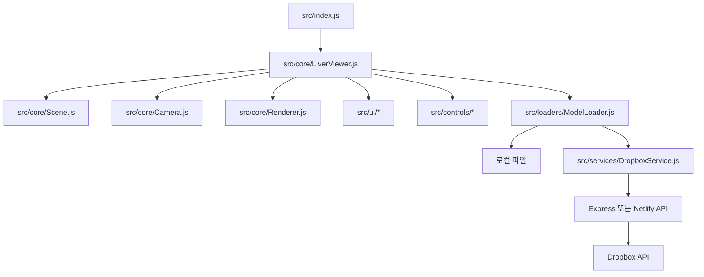

# LiverAIz 3D Web Viewer

Three.js로 구현한 간 3D 모델 뷰어입니다. 브라우저와 Windows 데스크톱 앱에서 GLB 모델을 불러오고, 모델 탐색·측정·변형·카메라 제어·웹캠 배경·Dropbox 기반 모델 공유를 제공합니다.

## 주요 기능

- **3D 모델 뷰어**: GLB/GLTF 모델과 HDR 환경 맵을 로드하고 씬을 구성합니다.
- **모델 탐색**: 로컬 파일 또는 Dropbox의 `model.json`을 통해 모델 목록을 불러옵니다.
- **카메라 제어**: 궤도 제어, 확대/축소, 시점 저장·재생을 지원합니다.
- **측정 및 변형**: 모델 길이 측정, 이동·회전·스케일 조정, 메시 윤곽선 표시를 제공합니다.
- **모델 정보 UI**: 오브젝트 목록, 메시 라벨, 툴팁, 설명 패널을 제공합니다.
- **웹캠 배경**: CameraPlayer를 사용해 실시간 카메라 영상을 씬 배경으로 표시할 수 있습니다.
- **실행 환경**: Vite 기반 웹 앱과 Electron 기반 Windows 패키징을 지원합니다.
- **Dropbox 연동**: 공유 폴더의 모델 메타데이터와 파일을 프록시하고 카메라 상태 JSON을 업로드합니다.

## 빠른 시작

### 요구 사항

- Node.js 18 이상
- npm 9 이상
- Dropbox 기능을 사용할 경우 Dropbox 액세스 토큰

### 설치

```bash
npm install
npm install --prefix functions
```

### 웹 개발 서버

```bash
npm run dev
```

Vite 서버는 기본적으로 `http://localhost:5175`에서 실행됩니다. `/api` 요청은 `http://localhost:3001`의 Express 서버로 프록시됩니다.

Dropbox API가 필요한 경우 별도의 터미널에서 로컬 API 서버도 실행합니다.

```bash
npm run server
```

Express 서버의 기본 포트는 `3001`이며 `PORT` 환경 변수로 변경할 수 있습니다.

## 실행 방법

### Electron 개발 모드

```bash
npm run electron:dev
```

이 명령은 Vite를 `5173` 포트에서 실행한 뒤 Electron 앱을 연결합니다.

### Electron 패키지

```bash
npm run dist       # 현재 플랫폼
npm run dist:win   # Windows NSIS 설치 파일과 portable 파일
```

## 모델 데이터

Dropbox 폴더에서 모델 목록을 로드하려면 `model.json`에 모델 파일과 썸네일의 공유 링크를 정의합니다.

```json
{
  "folderInfo": {
    "name": "간 모델 컬렉션",
    "description": "모델 설명"
  },
  "models": [
    {
      "name": "Liver",
      "description": "간 모델",
      "glbUrl": "https://www.dropbox.com/.../liver.glb?dl=0",
      "thumbnailUrl": "https://www.dropbox.com/.../liver.png?dl=0"
    }
  ]
}
```

Dropbox 공유 링크는 `DropboxService`에서 직접 다운로드 가능한 URL로 변환됩니다. 앱에서 모델 목록을 열고 공유 폴더 링크 또는 `model.json` 링크를 입력하면 됩니다.

## 환경 변수

로컬 API 서버는 프로젝트 루트의 `.env` 또는 `server/.env`에서 다음 값을 읽습니다.

```dotenv
dropbox_access_token=sl.xxxxxxxxxxxxxxxxx
PORT=3001
```

Netlify Functions에서는 `dropbox_access_token`을 Netlify 환경 변수로 등록합니다. 토큰은 저장소에 커밋하지 마세요. 클라이언트 코드에 토큰을 넣지 않고 Express 또는 Netlify Functions에서만 사용해야 합니다.

## 아키텍처



### 주요 모듈

| 경로 | 역할 |
| --- | --- |
| `src/index.js` | 웹/Electron 공통 애플리케이션 진입점과 정리 처리 |
| `src/core/LiverViewer.js` | 씬, 카메라, 렌더러, 로더, UI를 조합하는 뷰어 오케스트레이터 |
| `src/core/Scene.js` | Three.js 씬과 조명·환경 설정 |
| `src/core/Camera.js` | 카메라와 카메라 컨트롤 설정 |
| `src/loaders/ModelLoader.js` | GLB/GLTF 모델 로딩과 모델 상태 처리 |
| `src/controls/` | 컨트롤 매니저와 메시 변형 기능 |
| `src/functions/` | 측정, 웹캠 배경, XR, FOV, 카메라 재생 기능 |
| `src/services/DropboxService.js` | Dropbox 공유 링크와 `model.json` 처리 |
| `src/ui/` | 상단 바, 툴바, 패널, 모델 선택기, 라벨, 툴팁 |
| `server/server.js` | 로컬 Dropbox 프록시 및 카메라 상태 업로드 API |
| `functions/` | Netlify Functions용 서버리스 엔드포인트 |
| `electron/` | Electron 메인 프로세스와 preload 브리지 |

## API 엔드포인트

로컬 Express 서버가 제공하는 엔드포인트입니다.

| 메서드 | 경로 | 설명 |
| --- | --- | --- |
| `POST` | `/api/dropbox/folder-contents` | Dropbox 폴더의 `model.json` 조회 |
| `GET` | `/api/dropbox/file` | Dropbox의 개별 파일 스트리밍 |
| `GET` | `/api/dropbox/validate-token` | Dropbox 토큰 유효성 확인 |
| `POST` | `/api/dropbox/upload-camera-states` | 카메라 상태 JSON을 Dropbox에 업로드 |

Netlify 배포에서는 `/api/*` 요청이 `/.netlify/functions/*`로 리다이렉트됩니다.

## 빌드 및 배포

```bash
npm run build
npm run preview
```

빌드 결과는 `build/`에 생성됩니다. `netlify.toml`은 `build/`를 배포 디렉터리로 사용하고 `functions/`를 Netlify Functions 디렉터리로 지정합니다.

Netlify 배포 전 Functions 의존성을 설치합니다.

```bash
npm install --prefix functions
```

현재 저장소에는 `shorten-url.js` Function이 포함되어 있습니다. `netlify.toml`에 설정된 `dynamic-og` 라우팅에 대응하는 소스 파일은 현재 저장소에 없으므로, 해당 라우트를 활성화하려면 Function 구현과 배포 설정을 함께 추가해야 합니다.

## 프로젝트 구조

```text
.
├── electron/       # Electron main/preload
├── functions/      # Netlify Functions
├── public/         # HDRI, 모델, 텍스처, 아이콘
├── server/         # 로컬 Express API
├── src/
│   ├── components/ # 공통 컴포넌트
│   ├── controls/   # 카메라 및 메시 컨트롤
│   ├── core/       # 뷰어 핵심 객체
│   ├── functions/  # 측정, XR, 웹캠, 카메라 기능
│   ├── loaders/    # 3D 모델 로더
│   ├── materials/  # 재질 관리
│   ├── services/   # Dropbox 등 외부 서비스
│   ├── ui/         # 뷰어 UI
│   └── utils/      # 공통 유틸리티
├── build/          # Vite 빌드 출력물
├── index.html      # 웹 앱 HTML 진입점
├── package.json
└── vite.config.js
```

## 문제 해결

- **Vite에서 API 오류가 발생함**: `npm run server`가 실행 중인지, 서버가 `3001` 포트를 사용 중인지 확인합니다.
- **Dropbox 모델이 로드되지 않음**: `model.json`의 링크가 유효한지, 공유 권한과 `glbUrl` 경로를 확인합니다.
- **Dropbox API가 401을 반환함**: `dropbox_access_token`이 서버 환경 변수에 등록되어 있고 필요한 권한이 있는지 확인합니다.
- **웹캠이 표시되지 않음**: HTTPS 또는 localhost에서 실행하고 브라우저의 카메라 권한을 허용합니다.
- **Electron에서 파일이 열리지 않음**: 빌드 후 `electron/main.js`와 preload 브리지의 파일 경로 및 패키징 대상이 포함되는지 확인합니다.

## 기술 스택

- Three.js
- Vite 6
- Vanilla JavaScript / CSS
- Electron
- Express, Axios, Netlify Functions
- Pretendard

## 기여

변경 전 다음 명령으로 기본 동작을 확인합니다.

```bash
npm run build
```

기능을 추가할 때는 해당 기능을 소유하는 `src` 모듈과 README의 실행·구성 문서를 함께 갱신해 주세요.
